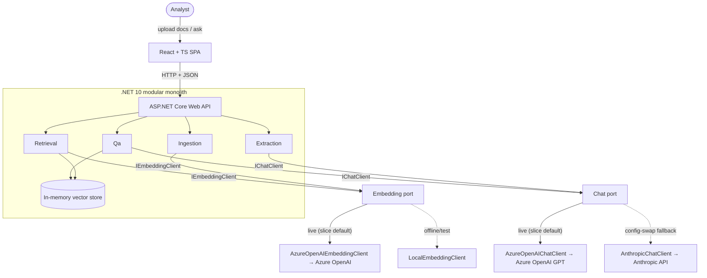

# Architecture

LandDoc Intelligence is a **modular monolith** (over microservices — see
[ADR-0004](decisions/0004-modular-monolith-over-microservices.md)): one ASP.NET Core (.NET 10 LTS —
see [ADR-0003](decisions/0003-dotnet-10-lts.md)) process whose modules
are separated by folder/namespace — `Ingestion`, `Extraction`, `Retrieval`, `Qa` — fronted by a
React/TypeScript SPA. All model access is hidden behind two ports (`IChatClient`,
`IEmbeddingClient`) with config-selected adapters.

## System context

## Containers & components
- **SPA** (React/TS) — two tabs (**Workspace** | **Dashboard**), light/dark **theme toggle**, one typed
  API client as the only `fetch`. *Workspace:* a multi-file **drag-and-drop** upload control
  (ingest-on-select, no submit button; PDF/text/Markdown), the session **document-tile grid**, a
  **persisted documents table** (search · CSV export · multi-select **delete** · row "View"), a question
  box + **answer-with-citations** (each citation links to its source document), and a **source-file
  viewer** (modal embedding the original PDF/text). *Dashboard:* KPI tiles, documents-by-location and
  ingest-over-time charts (Recharts), a needs-review list, and a lease-expiration widget — all aggregated
  client-side from `GET /documents`. React over Blazor — see
  [ADR-0006](decisions/0006-react-typescript-frontend-over-blazor.md).
- **Web API** (ASP.NET Core) — thin HTTP surface; delegates to modules.
- **Modules** (namespaces in one process):
  - `Ingestion` — PDF **or** text/Markdown (dispatched by file extension) → text → chunks → embeddings → vector store.
  - `Extraction` — document → structured fields (via `IChatClient`).
  - `Retrieval` — question → embed → top-k chunks from the vector store.
  - `Qa` — retrieved chunks + question → cited answer (via `IChatClient`).
- **Ports** — `IChatClient` (chat/completions) · `IEmbeddingClient` (embeddings only).
- **Adapters** — `AzureOpenAIChatClient` (live slice chat, OpenAI Chat Completions — [ADR-0012](decisions/0012-azure-openai-gpt-live-chat-adapter-per-provider-config.md), `Azure.AI.OpenAI`) / `AnthropicChatClient` (config-swap fallback, official Anthropic .NET SDK) ·
  `AzureOpenAIEmbeddingClient` (live slice — `text-embedding-3-small`, see [ADR-0013](decisions/0013-azure-openai-text-embedding-3-small-live-slice-embedding-adapter.md)) / `LocalEmbeddingClient` (offline/test — deterministic hashing).
- **Vector store** — behind a narrow async `IVectorStore` seam (`AddAsync` chunks at ingest;
  `TopKAsync(queryVector, k)` at ask; `DeleteByDocumentAsync(documentId)` on delete — spec 0008),
  config-selected via `VectorStore:Provider`. Live default is
  **Azure AI Search Free tier** (`AzureAiSearchVectorStore`, `landdoc-chunks` index, 256-d HNSW +
  cosine) — persistence at $0; `InMemoryVectorStore` (cosine over `float[]`) is the offline/test
  provider. See [ADR-0017](decisions/0017-azure-ai-search-free-tier-live-vector-store.md) (realizes
  [ADR-0005](decisions/0005-in-memory-vector-store-slice-azure-ai-search-production.md)).
- **Document store** — a *separate* port `IDocumentStore` (`SaveAsync` / `ListAsync` / `GetAsync` /
  `GetFileAsync` / `DeleteAsync` — spec 0008) for original files + document metadata, config-selected via
  `DocumentStore:Provider`.
  Live default is **Azure Blob Storage** (`AzureBlobDocumentStore`, container `documents`, two blobs per
  doc: bytes + metadata JSON; managed-identity-preferred auth); `InMemoryDocumentStore` is the offline/test
  provider. Object storage, not a similarity index — kept distinct from the vector store so PDF bytes never
  enter the search index. Backs `GET /documents`, `GET /documents/{id}`, `GET /documents/{id}/file` (spec
  0006). See [ADR-0018](decisions/0018-persisted-document-store-azure-blob-for-original-files-and-metadata.md).

## Layering — ports & adapters around model access
- Modules depend on the **port interfaces**, never on a concrete provider.
- Which adapter is wired is decided by **config** (`ModelClient:ChatProvider` — default `azureopenai`,
  `ModelClient:EmbeddingProvider`) at composition time — switching providers is never a code change.
  Per-provider credential sections (`AzureOpenAI:*`, `Anthropic:*`) let both chat adapters resolve at
  once — see [ADR-0012](decisions/0012-azure-openai-gpt-live-chat-adapter-per-provider-config.md).
- The two ports are split deliberately (chat vs. embeddings fail over differently; Anthropic has no
  embeddings endpoint) — see [ADR-0002](decisions/0002-split-model-access-into-chat-and-embedding-clients.md).

## Cross-cutting concerns
- **Configuration** — provider selection + model IDs live in config; never hardcode model IDs.
- **Secrets** — dev: `dotnet user-secrets` / env vars; prod: Azure Key Vault. Never committed.
- **Errors** — validate and throw early; the chat provider is config-selected (Azure OpenAI GPT live,
  Anthropic-direct as the config-swap fallback — [ADR-0012](decisions/0012-azure-openai-gpt-live-chat-adapter-per-provider-config.md));
  an availability auto-failover wrapper remains deferred. Field extraction at ingest is **best-effort** —
  a chat-provider failure yields empty fields and a stored document, not a 500 (spec 0001 amendment).
- **Citations** — every Q&A answer carries citations resolvable to a source chunk (core invariant).
- **Conventions** — C#: nullable enabled · async/await throughout · constructor DI · file-scoped
  namespaces · `record` DTOs. TypeScript: `strict` · function components · one typed API client.
  Full list in [`CLAUDE.md`](../../CLAUDE.md); this slice has no separate PATTERNS doc.
- **Logging / observability** — minimal for the slice; the observability stack is out of scope.

## Key boundaries
- SPA ↔ API: HTTP/JSON only (typed API client on the frontend), **single-origin** — the typed client
  calls relative paths; dev fronts the API via the Vite dev-proxy and prod serves the SPA + API from one
  container on a single origin (Azure Container Apps), so there is no CORS. See
  [ADR-0011](decisions/0011-single-origin-spa-api-topology.md) (single-origin principle) and
  [ADR-0016](decisions/0016-single-container-azure-container-apps-keyvault-secrets.md) (container/ACA realization).
- Modules ↔ providers: only through `IChatClient` / `IEmbeddingClient`.
- Slice ↔ production: the vector store now persists in **Azure AI Search Free tier** (live default;
  in-memory is offline/test) — see [ADR-0017](decisions/0017-azure-ai-search-free-tier-live-vector-store.md);
  cloud model access (Azure OpenAI) and Key Vault secret sourcing are **built** — see
  [ADR-0016](decisions/0016-single-container-azure-container-apps-keyvault-secrets.md). Scaling to
  Basic+ (managed identity, semantic ranker) is a tier/config change, not code.
