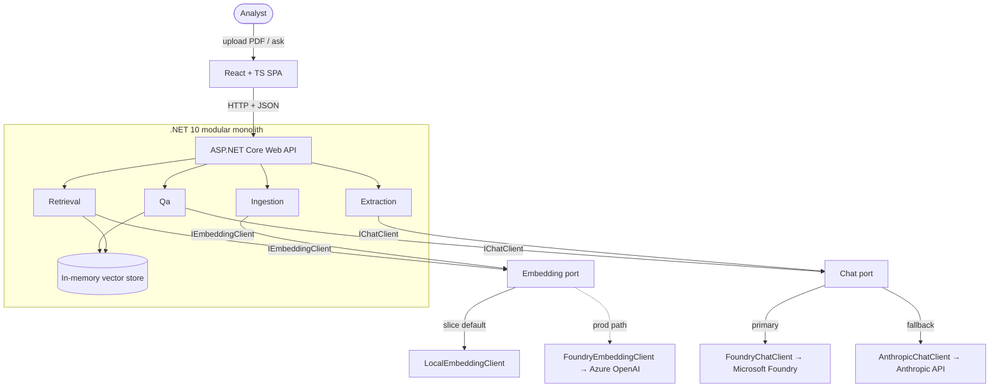

# Architecture

LandDoc Intelligence is a **modular monolith** (over microservices — see
[ADR-0004](decisions/0004-modular-monolith-over-microservices.md)): one ASP.NET Core (.NET 10 LTS —
see [ADR-0003](decisions/0003-dotnet-10-lts.md)) process whose modules
are separated by folder/namespace — `Ingestion`, `Extraction`, `Retrieval`, `Qa` — fronted by a
React/TypeScript SPA. All model access is hidden behind two ports (`IChatClient`,
`IEmbeddingClient`) with config-selected adapters.

## System context

## Containers & components
- **SPA** (React/TS) — upload control, extracted-fields view, question box, answer-with-citations.
  React over Blazor — see [ADR-0006](decisions/0006-react-typescript-frontend-over-blazor.md).
- **Web API** (ASP.NET Core) — thin HTTP surface; delegates to modules.
- **Modules** (namespaces in one process):
  - `Ingestion` — PDF → text → chunks → embeddings → vector store.
  - `Extraction` — document → structured fields (via `IChatClient`).
  - `Retrieval` — question → embed → top-k chunks from the vector store.
  - `Qa` — retrieved chunks + question → cited answer (via `IChatClient`).
- **Ports** — `IChatClient` (chat/completions) · `IEmbeddingClient` (embeddings only).
- **Adapters** — `FoundryChatClient` (primary) / `AnthropicChatClient` (fallback) ·
  `LocalEmbeddingClient` (slice — deterministic hashing, see [ADR-0008](decisions/0008-deterministic-hashing-embeddings-for-slice.md)) / `FoundryEmbeddingClient` (prod).
- **Vector store** — in-memory cosine similarity over `float[]` behind a narrow `IVectorStore` seam
  (add chunks at ingest; `TopK(queryVector, k)` at ask) so the prod swap is an adapter change (slice);
  Azure AI Search (prod, not built). See [ADR-0005](decisions/0005-in-memory-vector-store-slice-azure-ai-search-production.md).

## Layering — ports & adapters around model access
- Modules depend on the **port interfaces**, never on a concrete provider.
- Which adapter is wired is decided by **config** (`ModelClient:ChatProvider`,
  `ModelClient:EmbeddingProvider`) at composition time — switching providers is never a code change.
- The two ports are split deliberately (chat vs. embeddings fail over differently; Anthropic has no
  embeddings endpoint) — see [ADR-0002](decisions/0002-split-model-access-into-chat-and-embedding-clients.md).

## Cross-cutting concerns
- **Configuration** — provider selection + model IDs live in config; never hardcode model IDs.
- **Secrets** — dev: `dotnet user-secrets` / env vars; prod: Azure Key Vault. Never committed.
- **Errors** — validate and throw early; chat falls back Foundry → Anthropic on **availability**
  failures (connection / timeout / 5xx / 429-after-backoff), not on request-level 4xx — see
  [ADR-0007](decisions/0007-microsoft-foundry-gateway-anthropic-direct-fallback.md).
- **Citations** — every Q&A answer carries citations resolvable to a source chunk (core invariant).
- **Conventions** — C#: nullable enabled · async/await throughout · constructor DI · file-scoped
  namespaces · `record` DTOs. TypeScript: `strict` · function components · one typed API client.
  Full list in [`CLAUDE.md`](../../CLAUDE.md); this slice has no separate PATTERNS doc.
- **Logging / observability** — minimal for the slice; the observability stack is out of scope.

## Key boundaries
- SPA ↔ API: HTTP/JSON only (typed API client on the frontend), **single-origin** — the typed client
  calls relative paths; dev fronts the API via the Vite dev-proxy and prod via an Azure Static Web Apps
  linked backend, so there is no CORS. See [ADR-0011](decisions/0011-single-origin-spa-api-topology.md).
- Modules ↔ providers: only through `IChatClient` / `IEmbeddingClient`.
- Slice ↔ production: in-memory store + local embeddings are slice-only; Azure AI Search, Azure
  OpenAI embeddings, and Key Vault are the named (unbuilt) production path.
