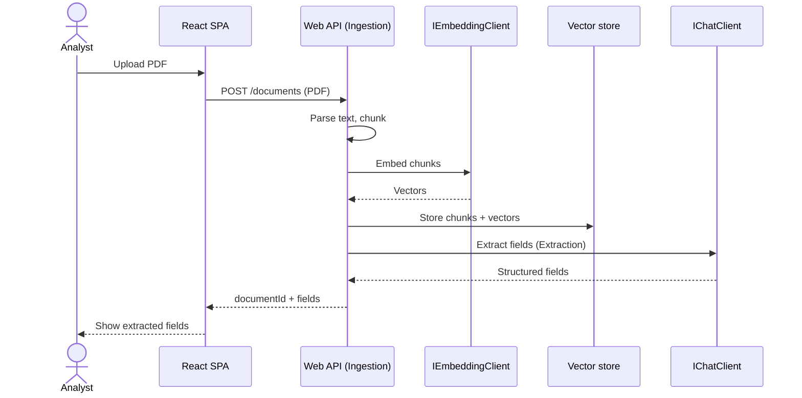

# Data flow

Two critical flows: **ingest** (upload → extracted fields, the only state mutation) and **ask**
(question → cited answer, read-only over the store).

## Ingest — upload a document



**State change:** ingest is the only write — chunks + vectors are added to the in-memory store, and
the document's extracted fields are produced.

## Ask — question with citations

```mermaid
sequenceDiagram
    actor A as Analyst
    participant SPA as React SPA
    participant API as Web API (Qa)
    participant E as IEmbeddingClient
    participant V as Vector store
    participant C as IChatClient

    A->>SPA: Ask a question
    SPA->>API: POST /documents/{id}/ask
    API->>E: Embed question
    E-->>API: Query vector
    API->>V: Top-k by cosine similarity
    V-->>API: Relevant chunks
    API->>C: Answer from chunks (context prompt-cached)
    note over C: Foundry primary;<br/>falls back to Anthropic on failure
    C-->>API: Answer + citations
    API-->>SPA: Answer + citations
    SPA-->>A: Cited answer
```

**State change:** none — ask is read-only. The retrieved chunks become the answer's grounding, and
the cited chunk IDs are returned so the UI can resolve each claim to its source text.

## Notes
- The same `IEmbeddingClient` embeds chunks at ingest and the query at ask — they must share a model
  (and thus dimension) for cosine similarity to be meaningful.
- Repeated document context sent to the chat model relies on **prompt caching** to cut cost/latency.
- Chat is **Foundry-primary with Anthropic-direct fallback** on availability failures — see
  [ADR-0007](decisions/0007-microsoft-foundry-gateway-anthropic-direct-fallback.md).
