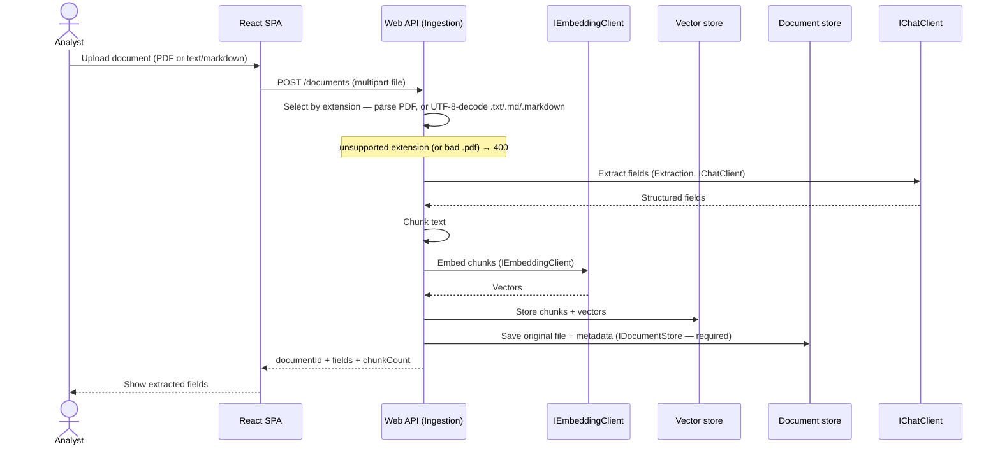

# Data flow

Two critical flows: **ingest** (upload → extracted fields, the only state mutation) and **ask**
(question → cited answer, read-only over the store).

## Ingest — upload a document



**State change:** ingest is the only write on the ask path's data — chunks + vectors are added to the
vector store, the original file + metadata + fields are persisted to the document store (spec 0006 /
ADR-0018; required — a save failure fails ingest), and the document's extracted fields are produced.
The viewer reads back via `GET /documents/{id}` + `GET /documents/{id}/file`.

## Ask — question with citations

```mermaid
sequenceDiagram
    actor A as Analyst
    participant SPA as React SPA
    participant API as Web API (Qa)
    participant E as IEmbeddingClient
    participant V as Vector store
    participant C as IChatClient

    A->>SPA: Ask a question
    SPA->>API: POST /ask { question }
    API->>E: Embed question (IEmbeddingClient)
    E-->>API: Query vector
    API->>V: Top-k by cosine (all ingested docs)
    note over V: empty store → 409
    V-->>API: Relevant chunks
    API->>C: Answer grounded in chunks (IChatClient)
    note over C: live slice default Azure OpenAI GPT (config-selected, ADR-0012);<br/>Anthropic-direct config-swap fallback · auto-failover deferred
    C-->>API: Answer + citations
    API-->>SPA: Answer + citations (≥1, each resolves)
    SPA-->>A: Cited answer
```

**State change:** none — ask is read-only. The retrieved chunks become the answer's grounding, and
the cited chunk IDs are returned so the UI can resolve each claim to its source text.

## Notes
- The same `IEmbeddingClient` embeds chunks at ingest and the query at ask — they must share a model
  (and thus dimension) for cosine similarity to be meaningful. Config-selected via
  `ModelClient:EmbeddingProvider`: live slice default `AzureOpenAIEmbeddingClient`
  (`text-embedding-3-small`), with `LocalEmbeddingClient` (deterministic hashing) as the offline/test
  embedder — see [ADR-0013](decisions/0013-azure-openai-text-embedding-3-small-live-slice-embedding-adapter.md).
- Retrieval is **global** — top-k across all ingested documents (see
  [ADR-0009](decisions/0009-corpus-wide-ask-retrieval-scope.md)); each citation carries `documentId`.
  An answer is never returned without ≥1 citation; an empty store returns `409`
  ([spec 0002](specs/0002-rag-qa-with-citations.md)).
- Repeated document context sent to the chat model is intended to rely on **prompt caching** to cut
  cost/latency — an optimization **deferred** for the slice (not required by spec 0002).
- The live slice default chat adapter is **Azure OpenAI GPT** (`AzureOpenAIChatClient`, OpenAI Chat
  Completions — [ADR-0012](decisions/0012-azure-openai-gpt-live-chat-adapter-per-provider-config.md),
  supersedes ADR-0007/0010); **Anthropic-direct** (official Anthropic .NET SDK) is the config-swap
  fallback. Provider + model are config-selected and the swap is config-only; an availability
  **auto-failover wrapper is deferred** to its own spec.
