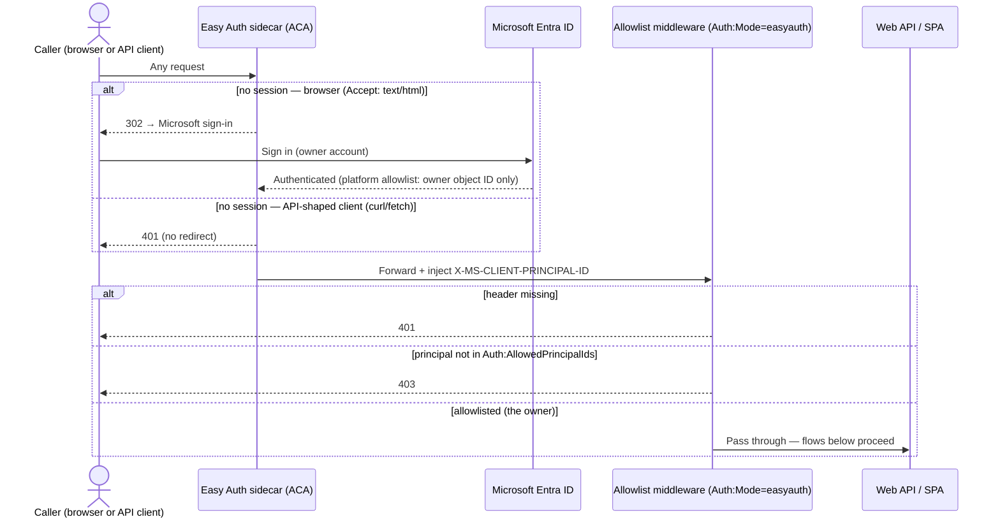
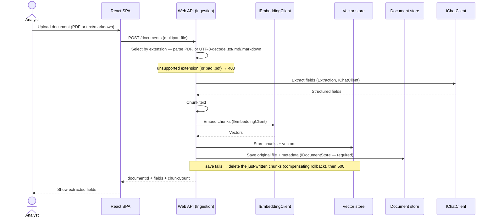
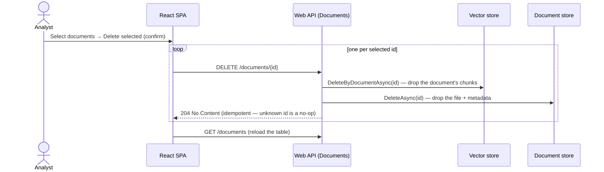

# Data flow

Two critical flows: **ingest** (upload → extracted fields, the only state mutation) and **ask**
(question → cited answer, read-only over the store).

## Auth gate — in front of every live flow

Live, every request below first passes the single-user gate (spec
[0013](specs/0013-single-user-auth-easy-auth-gate-app-allowlist.md) /
[ADR-0022](decisions/0022-single-user-entra-auth-easy-auth-gate-app-level-allowlist.md)): the
Container Apps **Easy Auth** sidecar authenticates against Microsoft Entra ID, then the app's
allowlist middleware checks the injected principal. The four flows below are the **post-gate** view;
locally/offline (`Auth:Mode=none`, the default) the gate is absent and requests hit the API directly.



## Ingest — upload a document



**State change:** ingest is the only write on the ask path's data — chunks + vectors are added to the
vector store, the original file + metadata + fields are persisted to the document store (spec 0006 /
ADR-0018; required — if the save fails, the just-written chunks are rolled back via a compensating
delete so no orphans remain, then ingest returns 500), and the document's extracted fields are produced.
The viewer reads back via `GET /documents/{id}` + `GET /documents/{id}/file`.

## Ask — question with citations

```mermaid
sequenceDiagram
    actor A as Analyst
    participant SPA as React SPA
    participant API as Web API (Qa)
    participant E as IEmbeddingClient
    participant V as Vector store
    participant C as IChatClient

    A->>SPA: Ask a question
    SPA->>API: POST /ask { question }
    API->>E: Embed question (IEmbeddingClient)
    E-->>API: Query vector
    API->>V: Top-k by cosine (all ingested docs)
    note over V: empty store → 409
    V-->>API: Relevant chunks
    API->>C: Answer grounded in chunks (IChatClient)
    note over C: live slice default Azure OpenAI GPT (config-selected, ADR-0012);<br/>Anthropic-direct config-swap fallback · auto-failover deferred
    C-->>API: Answer + citations
    API-->>SPA: Answer + citations (≥1, each resolves)
    SPA-->>A: Cited answer
```

**State change:** none — ask is read-only. The retrieved chunks become the answer's grounding, and
the cited chunk IDs are returned so the UI can resolve each claim to its source text.

## Delete — remove a document



**State change:** removes a document from **both** stores. Hard, best-effort, non-transactional — a
mid-delete failure can orphan one side; the operation is **idempotent**, so re-issuing the same DELETE
converges (see [ADR-0019](decisions/0019-hard-best-effort-non-transactional-document-deletion.md),
[spec 0008](specs/0008-delete-documents-multi-select.md)).

## Usage — LLM ops dashboard

```mermaid
sequenceDiagram
    actor O as Operator
    participant SPA as React SPA (Ops / Usage)
    participant API as Web API (Usage)
    participant U as IUsageSource
    participant M as Azure Monitor metrics
    participant K as UsageCostCalculator

    O->>SPA: Open Ops / Usage, pick range (24h/7d/30d)
    SPA->>API: GET /usage?range=…
    note over API: unrecognized range → 400
    API->>U: GetUsageAsync(range)
    U->>M: Query platform metrics (tokens · requests · latency), split by ModelDeploymentName
    note over U,M: live adapter only; inmemory returns canned aggregates offline/test
    M-->>U: Raw aggregates (no cost)
    U-->>API: UsageData
    API->>K: ToReport(data, range) — tokens × price table
    K-->>API: UsageReport (+ estimatedCostUsd)
    API-->>SPA: 200 (zeros + 200 when the window has no data)
    SPA-->>O: Totals · per-deployment · requests · latency
```

**State change:** none — usage is read-only and reads **live** from Azure Monitor each call (no stored
history). Cost is **computed** from a non-secret price table (an estimate, not the invoice); the source is
config-selected (`UsageSource:Provider` — `azuremonitor` live / `inmemory` offline-test) and cost is layered
on **outside** the adapter by a pure calculator (see
[ADR-0020](decisions/0020-llm-usage-cost-observability-azure-monitor-metrics.md),
[spec 0009](specs/0009-llm-usage-and-cost-ops-dashboard.md)).

## Notes
- The same `IEmbeddingClient` embeds chunks at ingest and the query at ask — they must share a model
  (and thus dimension) for cosine similarity to be meaningful. Config-selected via
  `ModelClient:EmbeddingProvider`: live slice default `AzureOpenAIEmbeddingClient`
  (`text-embedding-3-small`), with `LocalEmbeddingClient` (deterministic hashing) as the offline/test
  embedder — see [ADR-0013](decisions/0013-azure-openai-text-embedding-3-small-live-slice-embedding-adapter.md).
- Retrieval is **global** — top-k across all ingested documents (see
  [ADR-0009](decisions/0009-corpus-wide-ask-retrieval-scope.md)); each citation carries `documentId`.
  An answer is never returned without ≥1 citation; an empty store returns `409`
  ([spec 0002](specs/0002-rag-qa-with-citations.md)).
- The **Dashboard** is read-only and adds no new server flow — it reads the same `GET /documents` list
  and aggregates it **client-side** (KPIs, charts, needs-review, lease expirations); the documents-table
  search + CSV export also operate on that already-fetched data ([spec 0007](specs/0007-insights-dashboard-and-document-search-export.md)).
- Repeated document context sent to the chat model is intended to rely on **prompt caching** to cut
  cost/latency — an optimization **deferred** for the slice (not required by spec 0002).
- The live slice default chat adapter is **Azure OpenAI GPT** (`AzureOpenAIChatClient`, OpenAI Chat
  Completions — [ADR-0012](decisions/0012-azure-openai-gpt-live-chat-adapter-per-provider-config.md),
  supersedes ADR-0007/0010); **Anthropic-direct** (official Anthropic .NET SDK) is the config-swap
  fallback. Provider + model are config-selected and the swap is config-only; an availability
  **auto-failover wrapper is deferred** to its own spec.
