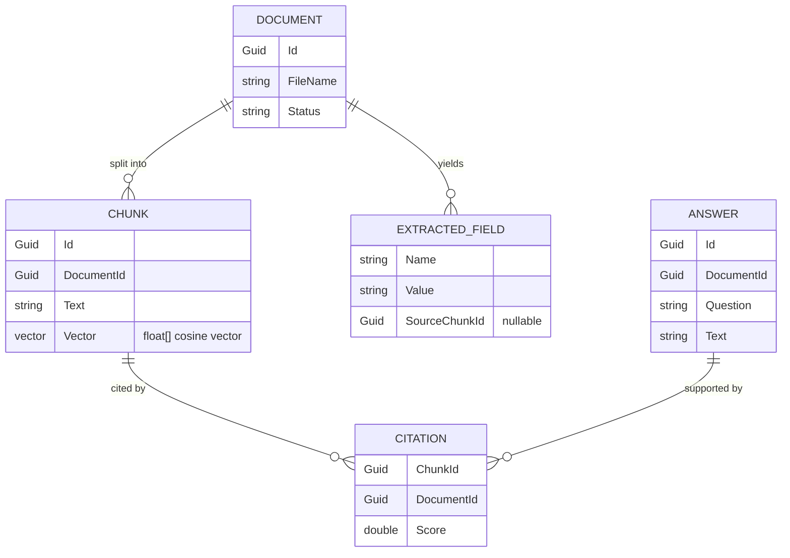

# Data model

The slice is **in-memory** — these are domain types (C# `record`s), not database tables. They model
the RAG pipeline's state: a `Document` is split into `Chunk`s (each carrying an embedding vector) and
yields `ExtractedField`s; an `Answer` is supported by `Citation`s that resolve back to chunks.

## Entities
- **Document** — an uploaded PDF and its ingest status (`Status` is `"ready"` once ingested). There is
  no stored `Document` record in the slice: a document is identified by a generated `documentId` and
  surfaced through the `POST /documents` response (`id`, `fileName`, `status`, the extracted `fields`,
  and a **derived** `chunkCount` — the count of the document's stored chunks, not a stored field).
- **Chunk** — a contiguous slice of a document's text plus its embedding vector.
- **ExtractedField** — a structured field pulled from the document (e.g. royalty, lessor), with the
  chunk it came from (`SourceChunkId` may be null when a field isn't pinned to a chunk).
- **Answer** — a generated response to a question about a document.
- **Citation** — a pointer from an answer (or extracted field) to the chunk that supports it (carries
  `ChunkId` + `DocumentId` + `Score`). The `POST /ask` response DTO additionally inlines the chunk
  `text` (resolved from the store) so the UI can show the source without a second call.

## Invariants
- Every `Chunk` belongs to exactly one `Document`.
- All embeddings within a store share one dimension (cosine similarity requires equal length).
- Every `Answer` carries **≥ 1** `Citation`, and every `Citation.ChunkId` resolves to a stored `Chunk`.
- `ExtractedField.SourceChunkId` (when set) resolves to a stored `Chunk`.

## Indexes / migrations
- None — the store is an in-memory collection scanned by cosine similarity for the slice
  (see [ADR-0005](decisions/0005-in-memory-vector-store-slice-azure-ai-search-production.md)).
- **Production path** (out of scope): chunks + vectors move to Azure AI Search, which owns the
  vector index and its build/refresh; there is no relational schema or migration story here.
