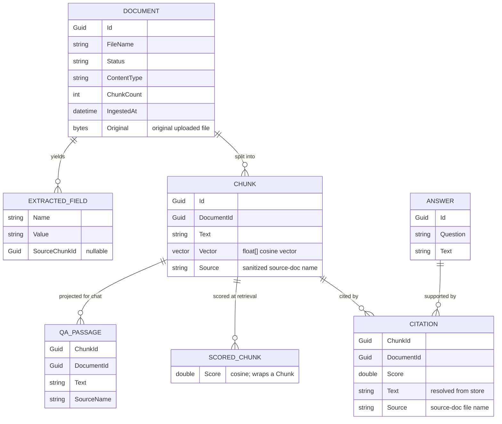

# Data model

The slice is **in-memory** — these are domain types (C# `record`s), not database tables. They model
the RAG pipeline's state: a `Document` is split into `Chunk`s (each carrying an embedding vector) and
yields `ExtractedField`s; an `Answer` is supported by `Citation`s that resolve back to chunks.

## Entities
- **Document** — an uploaded document (PDF, text, or Markdown) and its ingest status (`Status` is
  `"ready"` once ingested). Since spec 0006 / ADR-0018 the document **is** persisted: the original
  uploaded bytes plus metadata (`Id`, `FileName`, `Status`, `ContentType`, `ChunkCount`, the extracted
  `Fields`, `IngestedAt`) are stored via the `IDocumentStore` port, so the corpus survives restart and the
  original file can be viewed (`GET /documents/{id}/file`). `DocumentMetadata` is the read shape returned
  by `GET /documents` (list) and `GET /documents/{id}` (detail); `DocumentFile` carries the bytes +
  content type for the file endpoint.
- **Chunk** — a contiguous slice of a document's text, its embedding vector, and `Source` — the
  sanitized source-document name (newlines/brackets neutralized) used to label the chunk in the grounding
  prompt (ADR-0014).
- **ExtractedField** — a structured field pulled from the document (e.g. royalty, lessor), with the
  chunk it came from (`SourceChunkId` may be null when a field isn't pinned to a chunk).
- **Answer** — a generated response to a question over the **whole corpus** (global `/ask`, ADR-0009),
  not scoped to one document — its supporting `Citation`s each carry a `DocumentId`. Conceptual: the
  slice stores no `Answer` record (the `/ask` response is `answer` + `citations[]`).
- **Citation** — a pointer from an answer (or extracted field) to the chunk that supports it (carries
  `ChunkId` + `DocumentId` + `Score`). The `POST /ask` response DTO additionally inlines the chunk
  `Text` (resolved from the store) and the `Source` file name (spec 0006 / ADR-0014 follow-on) so the UI
  can label the citation and link to the source document without a second call.
- **ScoredChunk** — a retrieved `Chunk` paired with its cosine `Score`; the `IVectorStore.TopKAsync`
  result. Transient — not stored.
- **QaPassage** — the chat-context projection of a retrieved chunk (`ChunkId`, `DocumentId`, `Text`,
  `SourceName`) passed to `IChatClient.AnswerAsync`; `SourceName` labels each passage by source document
  so cross-document answers can disambiguate (ADR-0014). Keeps the chat port free of `Storage` types
  (ADR-0002 / ADR-0004). Transient — not stored.

## Invariants
- Every `Chunk` belongs to exactly one `Document`.
- All embeddings within a store share one dimension (cosine similarity requires equal length).
- Every `Answer` carries **≥ 1** `Citation`, and every `Citation.ChunkId` resolves to a stored `Chunk`.
- `ExtractedField.SourceChunkId` (when set) resolves to a stored `Chunk`.

## Indexes / migrations
- **Live default — Azure AI Search Free tier** (`landdoc-chunks` index): key = chunk id; fields
  `documentId`, `text`, `source`; a 256-d vector field (HNSW + cosine) sized to `Embedding:Dimension`.
  Chunks **persist across restarts/redeploys**; the adapter ensures the index exists on startup
  (idempotent). No relational schema — the index is the store. See
  [ADR-0017](decisions/0017-azure-ai-search-free-tier-live-vector-store.md).
- **Re-ingest, not migrate:** an embedding model/dimension change invalidates the index (the 256-d
  field is fixed at create) → re-ingest. Keep the same embedder for index and query (cosine invariant).
- **Offline/test** — `InMemoryVectorStore`, a cosine-scanned in-process collection (no persistence),
  selected via `VectorStore:Provider=inmemory` (see
  [ADR-0005](decisions/0005-in-memory-vector-store-slice-azure-ai-search-production.md)).

### Document store (original files + metadata) — ADR-0018
A **separate** store from the chunk index (object storage, not a similarity index), via the
`IDocumentStore` port, config-selected by `DocumentStore:Provider`:
- **Live default — Azure Blob Storage** (`azureblob`): container `documents` on `stlanddochr01`, two blobs
  per document — `"{id}"` (original bytes, with `Content-Type`) and `"{id}.json"` (the `DocumentMetadata`).
  `ListAsync` enumerates the `*.json` blobs. Managed-identity-preferred auth (`Blob:ServiceUri` +
  `DefaultAzureCredential`), connection-string fallback (`Blob:ConnectionString`). Persists across
  restarts/redeploys; the container is created on startup (idempotent).
- **Offline/test** — `InMemoryDocumentStore` (no persistence), selected via `DocumentStore:Provider=inmemory`
  (pinned in tests by `TestModuleInitializer`).
