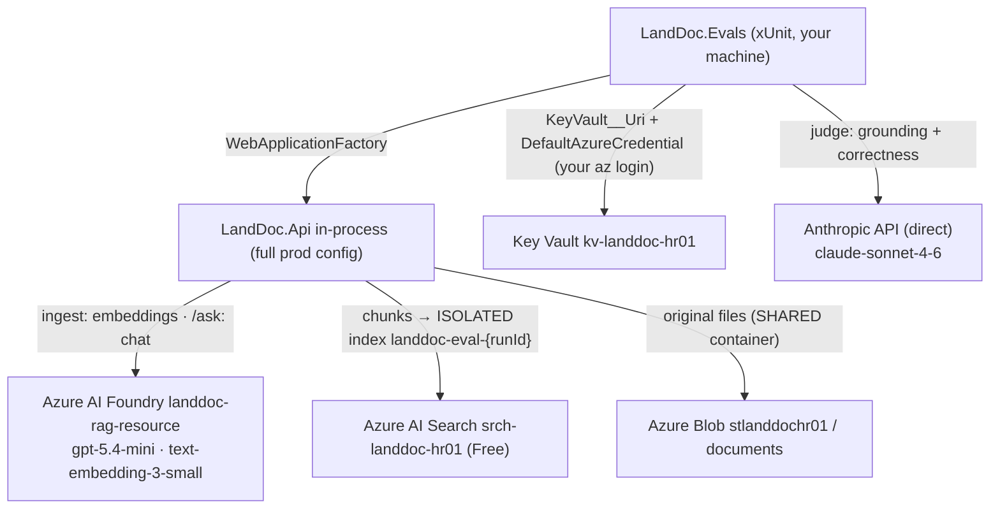

# RAG Answer-Quality Eval Harness — operations guide

> **What this is:** how to run, set up, and reason about the on-demand evaluation harness
> (`backend/eval/LandDoc.Evals`, spec [0012](specs/0012-rag-answer-quality-eval-harness.md) /
> [ADR-0021](decisions/0021-llm-eval-harness-and-judge-model.md)). It runs the **real** pipeline against
> the **live Azure/Foundry stack** and scores answer quality. This is the operational companion to the
> project [README](../../backend/eval/LandDoc.Evals/README.md); the Azure resource inventory lives in
> [AZURE-CONFIG.md](AZURE-CONFIG.md) and is referenced (not duplicated) here.
>
> 🔒 Secret **names** only in this file — never values. First verified live on **2026-06-09**.

---

## 1. What it is, and why it's separate

The offline green suite (`dotnet test LandDoc.slnx`) proves the pipeline's **contract** with fakes
(`FakeChatClient`, `LocalEmbeddingClient`, in-memory stores) — free, deterministic, offline, runs in CI.
It can't measure whether real answers are any *good*.

This harness does the opposite on purpose: it boots the **full production stack** and scores three metrics
over a curated subset of `samples/leases/*.pdf`:

| Metric | Evaluator | Needs a model? |
|---|---|---|
| **recall@k** | `RecallAtKEvaluator` (custom) — expected source file names vs the `/ask` answer's `Citation.Source` | no — deterministic |
| **groundedness** | `GroundednessEvaluator` (`Microsoft.Extensions.AI.Evaluation.Quality`) — context = the cited passages | yes — LLM judge |
| **correctness** | `EquivalenceEvaluator` — answer vs the golden `expectedAnswer` | yes — LLM judge |

It is **deliberately excluded from `LandDoc.slnx` and CI** — it needs real keys, costs money, and is
non-deterministic, so it must never gate a PR. It is **report-only by default** (records scores, never
fails on quality); an opt-in floor turns the metrics into hard pass/fail gates.

## 2. What it touches in Azure / Foundry / Anthropic



| Dependency | Resource | How the eval uses it | Auth | Isolation / residue |
|---|---|---|---|---|
| **Chat (SUT)** | Foundry `landdoc-rag-resource`, deployment `gpt-5.4-mini` | answers each `/ask` | `AzureOpenAI--ApiKey` (from KV) | read-only; no state |
| **Embeddings (SUT)** | same Foundry resource, `text-embedding-3-small` (256-d) | embeds chunks at ingest + each query | `AzureOpenAI--ApiKey` (from KV) | read-only; no state |
| **Vector store** | Azure AI Search `srch-landdoc-hr01` (Free) | writes chunks to a **fresh, isolated index `landdoc-eval-{runId}`** | `Search--ApiKey` (from KV) | **fully isolated** — the live `landdoc-chunks` index is never touched; the eval index is **deleted on teardown** |
| **Document store** | Azure Blob `stlanddochr01`, container `documents` | writes each ingested file (bytes + metadata) | **Entra / `DefaultAzureCredential`** (your `az login`) via `Blob--ServiceUri` | **shared** with the live app — not container-isolated; each doc is **deleted on teardown** via `DELETE /documents/{id}` |
| **Secrets** | Key Vault `kv-landdoc-hr01` | overlays all the `*:ApiKey`/`:Endpoint` config | **Entra / `DefaultAzureCredential`** (your `az login`) | read-only |
| **Judge** | **Anthropic API, direct** (`api.anthropic.com`), `claude-sonnet-4-6` | grades groundedness + correctness | `Anthropic--ApiKey` (from KV) | read-only; no state |

> **Why the judge is Anthropic-direct, not Claude-in-Foundry:** an individual PAYG subscription gets
> **0 TPM/RPM for partner/Marketplace models in Foundry** (Claude needs Enterprise/MCA-E — see
> [AZURE-CONFIG.md §1](AZURE-CONFIG.md)). The system-under-test therefore uses Azure OpenAI GPT, and the
> eval **judge** calls Anthropic directly with the same `Anthropic:ApiKey` the app keeps as its config-swap
> fallback. The judge is wired as a **MEAI `IChatClient`**, distinct from the project's own `IChatClient`
> port — the two never mix.

> ⚠️ **Blob is the one non-isolated dependency.** While a run is in flight (and until teardown finishes)
> the 11 eval docs are real entries in the shared `documents` container, so they appear in the live app's
> Documents tab / `GET /documents`. They do **not** pollute `/ask` answers (chunks live in the separate
> eval index). A clean run removes them; a crashed run can leave them — see [§7](#7-teardown--isolation).

## 3. One-time setup (per machine / per identity)

The deployed app uses its **managed identity** for all of this; a **local** run uses **your** `az login`
identity, which needs two data-plane role grants that subscription **Owner does not imply**:

```bash
az login   # the identity DefaultAzureCredential will use locally

OID=$(az ad signed-in-user show --query id -o tsv)

# 1) read Key Vault secrets
az role assignment create --assignee "$OID" --role "Key Vault Secrets User" \
  --scope /subscriptions/<SUB_ID>/resourceGroups/rg-landdoc-deomo/providers/Microsoft.KeyVault/vaults/kv-landdoc-hr01

# 2) write+delete blobs (the Blob store uses Entra via Blob:ServiceUri, not a key)
az role assignment create --assignee "$OID" --role "Storage Blob Data Contributor" \
  --scope /subscriptions/<SUB_ID>/resourceGroups/rg-landdoc-deomo/providers/Microsoft.Storage/storageAccounts/stlanddochr01
```

- RBAC takes **~1–5 min to propagate** (was ~40 s on 2026-06-09).
- **Azure OpenAI and Azure AI Search need no role grant** — they use API **keys** read from Key Vault.
- No code/secret setup is needed beyond this: pointing the run at the vault (next section) supplies every
  key. The judge's `top_p` workaround is already in the code (`SingleSamplingParameterChatClient`).

Confirm access before a long run:

```bash
az keyvault secret show --vault-name kv-landdoc-hr01 -n Search--Endpoint --query value -o tsv   # KV read
az storage blob upload --account-name stlanddochr01 -c documents -n _probe -f /dev/null \
  --auth-mode login --overwrite && \
  az storage blob delete --account-name stlanddochr01 -c documents -n _probe --auth-mode login   # blob write+delete
```

## 4. Running it

From the repo root, after `az login`:

```bash
# Report-only (default): records scores, never fails on quality.
KeyVault__Uri=https://kv-landdoc-hr01.vault.azure.net/ \
  dotnet test backend/eval/LandDoc.Evals

# Quality gate: fail the run when a metric is below its floor (floors in appsettings.eval.json).
KeyVault__Uri=https://kv-landdoc-hr01.vault.azure.net/ \
  dotnet test backend/eval/LandDoc.Evals -e Eval__Thresholds__Enabled=true

# A single case while iterating:
KeyVault__Uri=https://kv-landdoc-hr01.vault.azure.net/ \
  dotnet test backend/eval/LandDoc.Evals --filter "DisplayName~midland-royalty"
```

- **`KeyVault__Uri` must be an environment variable, not `appsettings.eval.json`.** `Program.cs` decides
  whether to add the vault config source *before* the test fixture's config layer is applied, so a value in
  the eval json arrives too late. The env var is present from process start.
- Alternative without Key Vault: set each secret directly as `AzureOpenAI__ApiKey`, `AzureOpenAI__Endpoint`,
  `Search__ApiKey`, `Search__Endpoint`, `Anthropic__ApiKey`, and (to skip the blob role grant)
  `Blob__ConnectionString` with `Blob__ServiceUri` unset. The vault path is preferred.
- **Runtime:** ~2.5 min with the judge active (≈ 18 `/ask` + 36 judge calls). If a run finishes in ~25 s,
  the judge silently errored — see [§6](#6-troubleshooting).

### Config knobs (`appsettings.eval.json` + env overrides)

| Key | Default | Meaning |
|---|---|---|
| `Eval:JudgeModel` | `claude-sonnet-4-6` | the Anthropic judge model id |
| `Eval:Thresholds:Enabled` | `false` | report-only when false; hard pass/fail gate when true |
| `Eval:Thresholds:Recall@K` | `0.8` | recall floor (0–1) when gating |
| `Eval:Thresholds:Groundedness` | `4.0` | groundedness floor (1–5) when gating |
| `Eval:Thresholds:Equivalence` | `4.0` | correctness floor (1–5) when gating |

Provider selection (`azureopenai` / `azuresearch` / `azureblob`) is fixed in `appsettings.eval.json`; the
fixture appends a unique `Search:IndexName = landdoc-eval-{runId}` per run.

## 5. Reading the results

Each run writes a per-case JSON to a disk result store under the test output's `eval-results/` (e.g.
`backend/eval/LandDoc.Evals/bin/Debug/net10.0/eval-results/results/Default/<case>/<n>.json`). Each file
holds the question, the answer, the three metric values + reasons, and — usefully for debugging — the
**grounding context** (the exact cited passages the judge saw) and the **ground truth**.

Render the HTML report with the `aieval` tool:

```bash
dotnet tool install --global Microsoft.Extensions.AI.Evaluation.Console   # once
aieval report --path backend/eval/LandDoc.Evals/bin/Debug/net10.0/eval-results --output eval-report.html
```

### Dashboard scorecard (spec 0011) + refreshing the snapshot
Every run also emits a compact **`eval-summary.json`** (metric means + per-case rows + run date) to the
result-store root. The SPA's Dashboard renders a committed copy of that file as the **"Answer quality (eval)"**
card — a build-time import (no fetch, so the single-fetch invariant holds), so it's a **dated snapshot**, not
live. To refresh what the page shows after a run:

```bash
cp backend/eval/LandDoc.Evals/bin/Debug/net10.0/eval-results/eval-summary.json \
   frontend/src/ui/dashboard/eval-summary.json
# commit the updated snapshot, then redeploy (the card's "as of <date>" makes staleness obvious)
```

## 6. Troubleshooting

| Symptom | Cause | Fix |
|---|---|---|
| Run "passes" in ~25 s; `Groundedness`/`Equivalence` are `$type: none` with an `AnthropicBadRequestException` | The MEAI quality evaluators send **both** `temperature` and `top_p`; Claude rejects both | **Already fixed** in `Judge/SonnetJudge.cs` (`SingleSamplingParameterChatClient` clears `TopP`). If it recurs, that wrapper was bypassed. |
| `403` / `AuthorizationPermissionMismatch` writing a blob | Local identity lacks **Storage Blob Data Contributor** (subscription Owner ≠ data-plane) | [§3](#3-one-time-setup-per-machine--per-identity) grant; wait for propagation |
| Right after granting a role, still denied | RBAC not yet propagated | wait 1–5 min and retry |
| `Anthropic:ApiKey is required…` thrown at startup | vault not loaded or secret missing | ensure `KeyVault__Uri` env var is set and you have **Key Vault Secrets User** |
| Vault loads but secrets empty | KV read denied | grant **Key Vault Secrets User** on `kv-landdoc-hr01` |
| `/ask` returns `409` | the eval index is empty (ingest failed) | check the ingest step / blob + Search access |

## 7. Teardown & isolation

On fixture dispose (after all cases run), the harness:
1. `DELETE /documents/{id}` for every ingested doc — removes its **Blob** document **and** its **Search**
   chunks (spec 0008);
2. `SearchIndexClient.DeleteIndexAsync(landdoc-eval-{runId})` — drops the isolated index object.

Both are **best-effort with a logged warning**. A normal completed run leaves **no residue** (verified
2026-06-09: no leftover `landdoc-eval-*` index; no eval blobs in `documents`). **If a run is interrupted**
(Ctrl-C, crash, sleep) **before teardown**, residue can remain:
- a leaked `landdoc-eval-*` Search index — harmless, uniquely named; drop anytime.
- leftover eval docs in the shared `documents` container — remove via the app's Documents tab, `DELETE
  /documents/{id}`, or `az storage blob delete`.

To make the blob side airtight, a future change could point the eval at a per-run container
(`documents-eval-{runId}`) instead of the shared one — see the project README's "harden" note.

## 8. Cost

Per run ≈ 18 `/ask` (each: 1 embedding + 1 `gpt-5.4-mini` completion) + 36 Sonnet 4.6 judge calls
(grounding + correctness × 18) + 11 ingest embedding batches — cents per run on the curated subset, but
real and non-deterministic. That, plus the RG budget (`landdoc-budget`, $25), is why it stays off CI and
report-only by default.

## 9. Setting it up from scratch (new subscription / after teardown)

If `rg-landdoc-deomo` was torn down ([AZURE-CONFIG.md §8](AZURE-CONFIG.md)), re-provision the stack first
(that doc is the source of truth), then do the eval-specific bits:

1. **Provision** the Foundry/AI Services resource + `gpt-5.4-mini` and `text-embedding-3-small` deployments,
   Azure AI Search (Free, index auto-created by the app), Blob storage + `documents` container, and Key
   Vault — per [AZURE-CONFIG.md §2–§5](AZURE-CONFIG.md).
2. **Store secrets** in Key Vault using the `--` names in [AZURE-CONFIG.md §5](AZURE-CONFIG.md): at minimum
   `AzureOpenAI--Endpoint`, `AzureOpenAI--ApiKey`, `Search--Endpoint`, `Search--ApiKey`, `Blob--ServiceUri`,
   and `Anthropic--ApiKey` (the judge). No new eval-only secret is introduced.
3. **Grant your local identity** the two roles in [§3](#3-one-time-setup-per-machine--per-identity).
4. **Run** as in [§4](#4-running-it). The eval index, ingested docs, and teardown are automatic.

No app code changes are needed — the runner supplies only config + the per-run index name.

## 10. CI (held)

A manual `workflow_dispatch` job (`.github/workflows/eval.yml`) that OIDC-logs into Azure, reads the same
secrets from Key Vault, runs the harness against `landdoc-eval-${run_id}`, and uploads the `aieval` HTML
report **is designed but intentionally NOT created** (held). The managed identity it would use already has
the equivalents of the §3 roles (Key Vault Secrets User + Storage Blob Data Contributor — see
[AZURE-CONFIG.md §6/§7](AZURE-CONFIG.md)).

## 11. Baseline + known findings (first live run, 2026-06-09)

18 cases, report-only: recall@k mean **0.96**, groundedness **4.67/5**, correctness **3.94/5**; both
absent-answer cases correctly abstained (no-hallucination path works). The harness surfaced **real product
issues** (not harness bugs):

- **Generation over-abstention** — `henderson-acres-multi` (640 acres) and `mckenzie-royalty` (3/16): the
  answer **was** in the cited passages, yet the model returned "not found".
- **Retrieval/chunking miss** — `reeves-royalty` (9/40) and `reeves-term` (five years): the value-bearing
  chunk **wasn't** in top-k, so the abstain was unavoidable given what was retrieved.

These belong on the RAG backlog (tune chunking/`Retrieval:TopK`, revisit the abstain prompt). Set
sensible floors here once addressed, then flip `Eval:Thresholds:Enabled=true` to make this a gate.

### Post-tuning ([spec 0010](specs/0010-rag-answer-quality-tuning.md), same day)
Acted on the misses with the harness as the feedback loop — all four are now fixed, no regressions, both
absent cases still abstain (5/5), no judge errors:

| | recall@k | groundedness | correctness |
|---|---|---|---|
| baseline | 0.96 | 4.67 | 3.94 |
| `Retrieval:TopK` 8→12 + softened answer prompt | 1.00 | 4.72 | 4.39 |
| + `Chunking` 800/150 → 1400/250 | **1.00** | **5.0** | **4.78** |

The two **depth** misses (`henderson-acres-multi`, `mckenzie-tract-multi`) cleared with TopK; the three
**retrieval** misses (`reeves-royalty`, `reeves-term`, `mckenzie-royalty`) needed the larger/more-overlapping
chunks so each value clause stays with its identifying context. Scores are now strong enough to set floors
and flip `Eval:Thresholds:Enabled=true` if you want a hard gate. (Note: the chunking change re-chunks the
**live** index on next deploy — existing `landdoc-chunks` content was embedded at 800/150 until re-ingested.)
